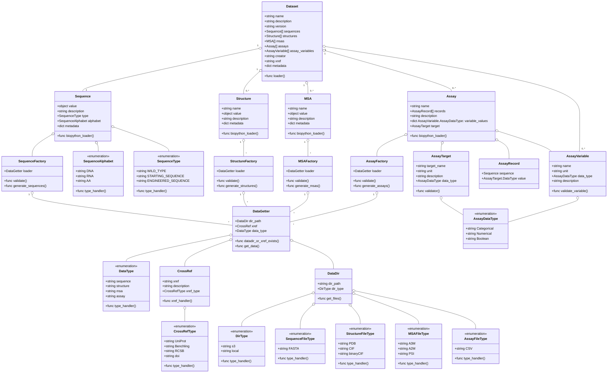

# Data Model

This document described the dataset used by Protein Gym 2. The dataset allows
users to access four collections of protein data:
1. Sequence(s)
2. Structure(s) 
3. multiple sequence alignment(s), MSA(s)
4. Assay(s) 

Additionally, the dataset contains metadata, like a name and description, and can be created from a [manifest](manifest.md).

The schema is designed for enabling:
1. Consistency: Ensure all the datasets follow the same structure.
2. Compatibility: Allow the framework to load and process datasets uniformly.
3. Extensibility: Allow for future additions without breaking existing datasets.
4. Clarity: Provide a clear understanding of the dataset components.

Class Diagram:

### Definitions

| **Module** | **Sub-Module**    | **Description**                                                                                                                                                                                                                                                                                                                                                                                                                                                  | **Notes**                       |
|------------|-------------------|------------------------------------------------------------------------------------------------------------------------------------------------------------------------------------------------------------------------------------------------------------------------------------------------------------------------------------------------------------------------------------------------------------------------------------------------------------------|---------------------------------|
| Dataset    |                   | It is a collection of biological data that are used for benchmarking pg2-models with pg2-benchmark framework. This class contains the metadata of the dataset, and the references to the sequences, structures, MSAs, and assays data types. Dataset class also contains the assay variables defined in section 6.                                                                                                                                               |                                 |
| DataGetter |                   | Handles the retrieval of data from either a local directory or a cross-reference (xref) to an external database. The data received is then used by data factories. DataGetter must have either a valid directory path or a cross-reference to fetch the data.                                                                                                                                                                                                    |                                 |
| DataGetter | DataDir           | Represents a directory where the data files are stored. It can be either the working directory or a cloud storage like SFTP servers, s3 buckets, etc.                                                                                                                                                                                                                                                                                                            |                                 |
| DataGetter | CrossRef          | Represents a cross-reference to an external database. The CrossRef class contains information about the external database and provides methods to retrieve data from it.                                                                                                                                                                                                                                                                                         |                                 |
| DataGetter | DataType          | The ProteinGym2 dataset module supports four data types given in Dataset definition.                                                                                                                                                                                                                                                                                                                                                                             | sequence, structure, msa, assay |
| Sequence   |                   | Represents a biological sequence. These sequences are the base sequences which are used in curation of other data types like assays, structures, msas.                                                                                                                                                                                                                                                                                                           |                                 |
| Sequence   | SequenceFactory   | Uses the DataGetter object to generate Sequence objects. The data loaded from the DataGetter is validated before generating the Sequence objects.                                                                                                                                                                                                                                                                                                                |                                 |
| Sequence   | SequenceAlphabet  | There are three types of sequence alphabets: DNA, RNA, AA.                                                                                                                                                                                                                                                                                                                                                                                                       | DNA, RNA, AA                    |
| Sequence   | SequenceType      | The ProteinGym2 dataset module supports three sequence types: WILD_TYPE, STARTING_SEQUENCE, ENGINEERED_SEQUENCE.                                                                                                                                                                                                                                                                                                                                                 |                                 |
| Sequence   | SequenceFileType  | When using DataDir, FASTA file types are supported.                                                                                                                                                                                                                                                                                                                                                                                                              | Only FASTA supported            |
| Structure  |                   | Represents the 2d/3d structure of a protein or nucleic acid. These structures are used in the curation of other data types like assays and MSAs.                                                                                                                                                                                                                                                                                                                 |                                 |
| Structure  | StructureFactory  | Uses the DataGetter object to generate Structure objects.                                                                                                                                                                                                                                                                                                                                                                                                        |                                 |
| Structure  | StructureFileType | The ProteinGym2 dataset module supports three structure file types: PDB, CIF, and mmCIF.                                                                                                                                                                                                                                                                                                                                                                         | PDB, CIF, mmCIF                 |
| MSA        |                   | It is the multi sequence alignment data.                                                                                                                                                                                                                                                                                                                                                                                                                         |                                 |
| MSA        | MSAFactory        | Uses the DataGetter object to generate MSA objects.                                                                                                                                                                                                                                                                                                                                                                                                              |                                 |
| MSA        | MSAFileType       | The ProteinGym2 dataset module supports three MSA file types: A3M, A2M, and PSI.                                                                                                                                                                                                                                                                                                                                                                                 | A3M, A2M, PSI                   |
| Assay      |                   | Assays are experimental data that contains modified or mutated sequences and corresponding values for targets. It is a supervised dataset where X is the modified sequences and Y is the target value. In addition to the sequences, assays also contain assay variables. These variables are biological factors that impact the assay results. For an assay, the assay variables are kept constant and the target value is measured for the modified sequences. |                                 |
| Assay      | AssayFactory      | Uses the DataGetter object to generate Assay objects.                                                                                                                                                                                                                                                                                                                                                                                                            |                                 |
| Assay      | AssayVariable     | Used to track important constant quantities of interest regarding an assay, like assay conditions (e.g. pH, temperature) or also more generally, e.g. the round of engineering an assay was performed in Represents the variables under which the assay was performed.                                                                                                                                                                                           |                                 |
| Assay      | AssayRecord       | Contains the sequence and the corresponding target value for the assay. Each record represents a single data point in the assay. Assay is created from a list of AssayRecord class instances.                                                                                                                                                                                                                                                                    |                                 |
| Assay      | AssayTarget       | Contains the metadata of the target value for the assay.                                                                                                                                                                                                                                                                                                                                                                                                         |                                 |
| Assay      | AssayDataType     | Represents the type of data in the assay: Categorical, Numerical, and Boolean.                                                                                                                                                                                                                                                                                                                                                                                   | Categorical, Numerical, Boolean |
| Assay      | AssayFileType     | Supported file type for assays.                                                                                                                                                                                                                                                                                                                                                                                                                                  | Only CSV supported              |

**Note**

1. Biopython can be replaced with Biotite

Future To-Do:
1. Sequences can be constructed from public databases like https://www.rcsb.org/, https://www.uniprot.org/, Benchling, etc.
2. Out of Scope: Connecting to internal IFF databases like LIMS, IFF-Benchling etc.

