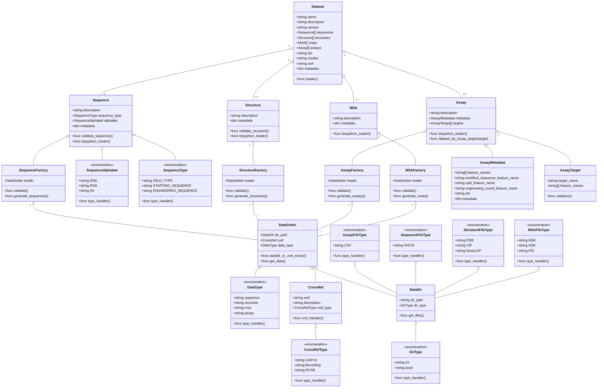

### Data Manifest Schema
This schema defines the structure of a dataset that is required to be compatible with the ProteinGYM2 framework. The datasets are comprised of four types of data: sequences, structures, multiple sequence alignments (MSAs), and assays. Each dataset is represented by a `Dataset` class that contains metadata and references to the various components. The datatypes (sequences, structures, MSAs, and assays) are defined as separate classes with their own metadata and file handling methods.

The schema is designed for enabling:
1. Consistency: Ensure all the datasets follow the same structure.
2. Compatibility: Allow the framework to load and process datasets automatically.
3. Extensibility: Allow for future additions without breaking existing datasets.
4. Clarity: Provide a clear understanding of the dataset components.

#### Definitions
- **Dataset**: The main class representing a dataset, that has four data types: sequences, structures, MSAs, and assays. The data 

The dataset can be loaded using a loader function and schema .toml file.

Class Diagram:

**Note**

1. Biopython can be replaced with Biotite

Future To-Do:
1. Sequences can be constructed from public databases like https://www.rcsb.org/, https://www.uniprot.org/, Benchling, etc.
2. Out of Scope: Connecting to internal IFF databases like LIMS, IFF-Benchling etc.

