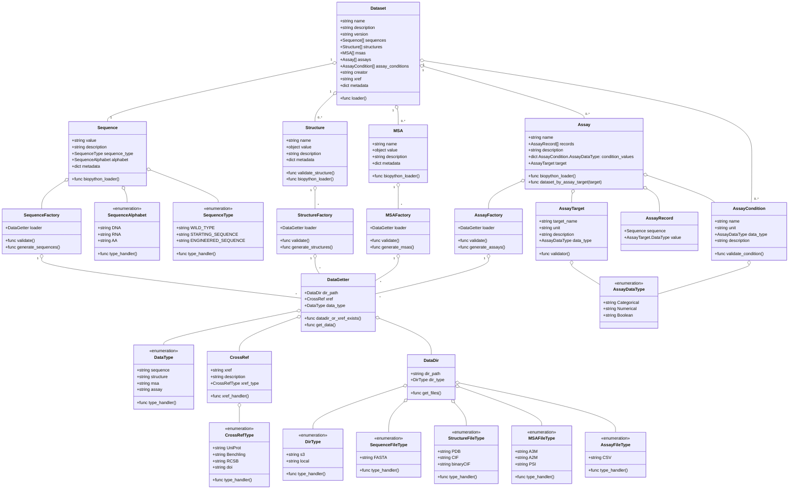

### Data Manifest Schema
This schema defines the structure of a dataset that is required to create pg2-datasets for the ProteinGYM2 framework. The datasets are comprised of four types of data: sequences, structures, multiple sequence alignments (MSAs), and assays. 

When creating a new pg2-dataset, dataset creator will supply as .toml manifest file which contains the information required to load the data objects. The datatypes (sequences, structures, MSAs, and assays) are defined as separate sub-classes with their own metadata and file handling methods.

The schema is designed for enabling:
1. Consistency: Ensure all the datasets follow the same structure.
2. Compatibility: Allow the framework to load and process datasets automatically.
3. Extensibility: Allow for future additions without breaking existing datasets.
4. Clarity: Provide a clear understanding of the dataset components.

### Definitions
1. **Dataset:** It is a collection of biological data that are used for benchmarking pg2-models with pg2-benchmark framework. This class contains the metadata of the dataset, and the references to the sequences, structures, MSAs, and assays data types. Dataset class also contains the assay conditions defined in section 6. 

2. **DataGetter:** It is a class that handles the retrieval of data from either a local directory or a cross-reference (xref) to an external database. The data recieved is then used by data factories. DataGetter must have either a valid directory path or a cross-reference to fetch the data. 
    
    - **DataDir:** It represents a directory where the data files are stored. It can be either the working directory or a cloud storage like SFTP servers, s3 buckets, etc. 
    
    - **CrossRef:** It represents a cross-reference to an external database. The CrossRef class contains information about the external database and provides methods to retrieve data from it.
    
    - **DataType:** The pg2-dataset module supports four data types given in Dataset definition.

3. **Sequence:** It represents a biological sequence. These sequences are the base sequences which are used in curation of other data types like assays, structures, msas. 

    - **SequenceFactory:** It uses the DataGetter object to generate Sequence objects. The data loaded from the DataGetter is validated before generating the Sequence objects. 

    - **SequenceAlphabet:** There are three types of sequence alphabets: DNA, RNA, AA.

    - **SequenceType:** The pg2-dataset module supports three sequence types: WILD_TYPE, STARTING_SEQUENCE, ENGINEERED_SEQUENCE.

    - **SequenceFileType:** When using DataDir, FASTA file types are supported.

4. **Structure:** It represents the 2d/3d structure of a protein or nucleic acid. These structures are used in the curation of other data types like assays and MSAs.
    
    - **StructureFactory:** It uses the DataGetter object to generate Structure objects.
    
    - **StructureFileType:** The pg2-dataset module supports three structure file types: PDB, CIF, and mmCIF.

5. **MSA:** It is the multi sequence alignment data.

    - **MSAFactory:** It uses the DataGetter object to generate MSA objects.

    - **MSAFileType:** The pg2-dataset module supports three MSA file types: A3M, A2M, and PSI.

6. **Assay:** Assays are experimental data that contains modified or mutated sequences and corresponding values for targets. It is a supervised dataset where X is the modified sequences and Y is the target value. In addition to the sequences, assays also contain assay conditions. These conditions are biological factors that impact the assay results. For an assay, the assay conditions are kept constant and the target value is measured for the modified sequences.
    - **AssayFactory:** It uses the DataGetter object to generate Assay objects.

    - **AssayCondition:** It represents the conditions under which the assay was performed. These conditions can include factors like temperature, pH, and other experimental variables. These conditions are constant for an assay.

    - **AssayRecord:** It contains the sequence and the corresponding target value for the assay. Each record represents a single data point in the assay. Assay is created from a list of AssayRecord class instances.

    - **AssayTarget:** It contains the metadata of the target value for the assay.

    - **AssayDataType:** It represents the type of data in the assay: Categorical, Numerical, and Boolean.

Class Diagram:

**Note**

1. Biopython can be replaced with Biotite

Future To-Do:
1. Sequences can be constructed from public databases like https://www.rcsb.org/, https://www.uniprot.org/, Benchling, etc.
2. Out of Scope: Connecting to internal IFF databases like LIMS, IFF-Benchling etc.

