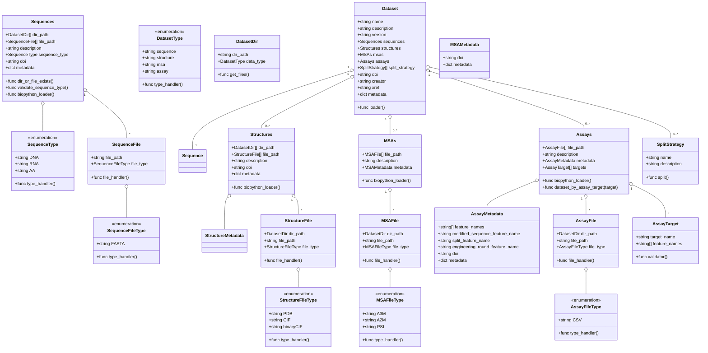

### Data Manifest Schema

```mermaid
classDiagram
    class Dataset {
        +string name
        +string description
        +string version
        +Sequences sequences
        +Structures structures
        +MSAs msas
        +Assays assays
        +SplitStrategy[] split_strategy
        +string doi
        +string creator   
        +string xref
        +dict metadata
        +func loader() 
    }
    class SplitStrategy {
        +string name
        +string description
        +func split()
    }
    class DatasetType {
        <<enumeration>>
        +string sequence
        +string structure
        +string msa
        +string assay
        +func type_handler()
    }
    class DatasetDir {
        +string dir_path
        +DatasetType data_type
        +func get_files()
    }


    class Sequences {
        +DatasetDir[] dir_path
        +SequenceFile[] file_path
        +string description
        +SequenceType sequence_type
        +string doi
        +dict metadata
        +func dir_or_file_exists()
        +func validate_sequence_type()
        +func biopython_loader()
    }
    class SequenceType {
        <<enumeration>>
        +string DNA
        +string RNA
        +string AA
        +func type_handler()
    }
    class SequenceFile {
        +string file_path
        +SequenceFileType file_type
        +func file_handler()
    }
    class SequenceFileType {
        <<enumeration>>
        +string FASTA
        +func type_handler()
    }

    class Structures {
        +DatasetDir[] dir_path 
        +StructureFile[] file_path
        +string description
        +string doi
        +dict metadata
        +func biopython_loader()
    }
    class StructureFile {
        +DatasetDir dir_path
        +string file_path
        +StructureFileType file_type
        +func file_handler()
    }
    class StructureFileType {
        <<enumeration>>
        +string PDB
        +string CIF
        +string binaryCIF
        +func type_handler()
    }


    class MSAs {
        +MSAFile[] file_path
        +string description
        +MSAMetadata metadata
        +func biopython_loader()
    }
    class MSAMetadata {
        +string doi
        +dict metadata
    }
    class MSAFile {
        +DatasetDir dir_path
        +string file_path
        +MSAFileType file_type
        +func file_handler()
    }
    class MSAFileType {
        <<enumeration>>
        +string A3M
        +string A2M
        +string PSI
        +func type_handler()
    }


    class Assays {
        +AssayFile[] file_path
        +string description
        +AssayMetadata metadata
        +AssayTarget[] targets
        +func biopython_loader()
        +func dataset_by_assay_target(target)
    }
    class AssayMetadata {
        +string[] feature_names
        +string modified_sequence_feature_name
        +string split_feature_name
        +string engineering_round_feature_name
        +string doi
        +dict metadata
    }
    class AssayFile {
        +DatasetDir dir_path
        +string file_path
        +AssayFileType file_type
        +func file_handler()
        }
    class AssayFileType {
        <<enumeration>>
        +string CSV
        +func type_handler()
    }
    class AssayTarget {
        +string target_name
        +string[] feature_names
        +func validator()
    }

    Dataset "1" o-- "1" Sequence
    Dataset "1" o-- "0..*" Structures
    Dataset "1" o-- "0..*" MSAs
    Dataset "1" o-- "0..*" Assays
    Dataset "1" o-- "0..*" SplitStrategy
    Sequences o-- SequenceType
    Sequences "1" o-- "*" SequenceFile
    SequenceFile o-- SequenceFileType
    Structures o-- StructureMetadata
    Structures "1" o-- "*" StructureFile
    StructureFile o-- StructureFileType
    MSAs "1" o-- "*" MSAFile
    MSAFile o-- MSAFileType
    Assays o-- AssayMetadata
    Assays "1" o-- "*" AssayFile
    Assays "1" o-- "*" AssayTarget
    AssayFile o-- AssayFileType
```