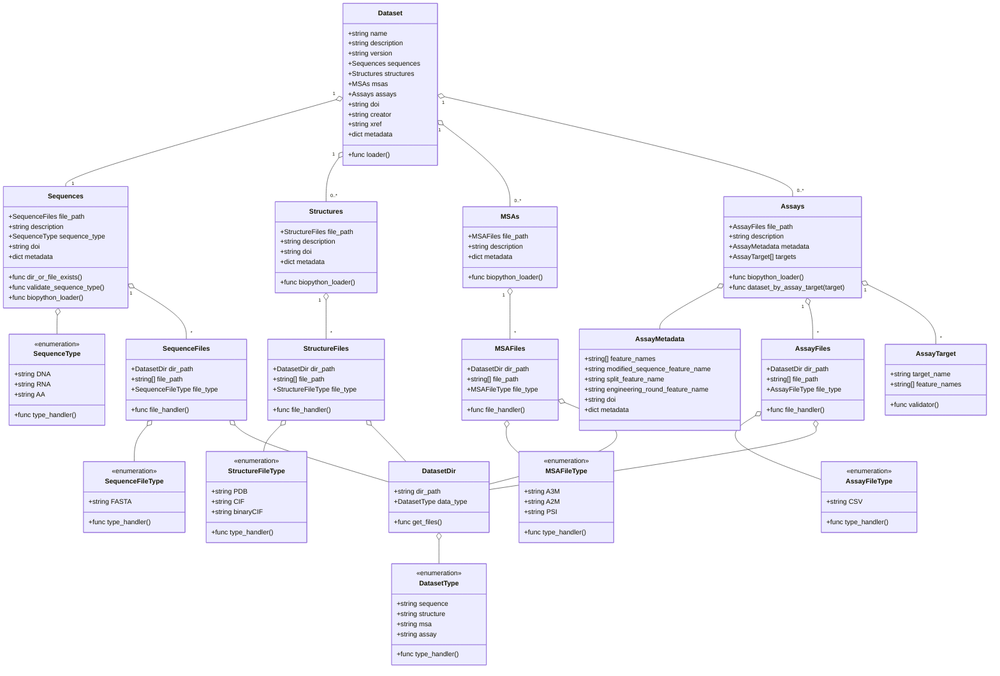

### Data Manifest Schema
This schema defines the structure of a dataset that is required to be compatible with the ProteinGYM2 framework. The datasets are comprised of four types of data: sequences, structures, multiple sequence alignments (MSAs), and assays. Each dataset is represented by a `Dataset` class that contains metadata and references to the various components. The datatypes (sequences, structures, MSAs, and assays) are defined as separate classes with their own metadata and file handling methods.

#### Motivation
The schema is designed for enabling:
1. Consistency: Ensure all the datasets follow the same structure.
2. Compatibility: Allow the framework to load and process datasets automatically.
3. Extensibility: Allow for future additions without breaking existing datasets.
4. Clarity: Provide a clear understanding of the dataset components.

